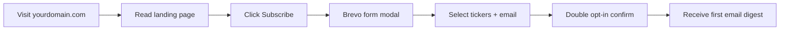
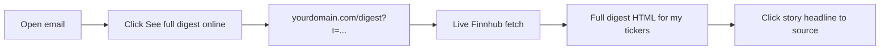
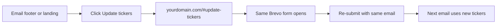

# Daily Digest — Product Requirements

**Status:** Draft  
**Version:** 1.1  
**Last updated:** 2026-08-13  
**Related:** [Technical Implementation](./technical-implementation.md)

---

## Repository split

| Repository | Role |
|------------|------|
| **[daily-digest](https://github.com/parasdhawan17/daily-digest)** (this project) | Vercel web app — landing page + live `/digest` |
| **[stock-news-bot](https://github.com/parasdhawan17/stock-news-bot)** (unchanged repo) | Email cron, Brevo, Finnhub fetch for email bodies |

This PRD covers the **Daily Digest** web product. Email requirements that touch the web (footer links, signing) are listed here; email sending stays in `stock-news-bot`.

---

## 1. Overview

**Daily Digest** is a free, twice-daily US stock news product. Subscribers choose tickers, receive personalized email briefings (from `stock-news-bot`), and can open a **live web digest** for their watchlist via a link in the email.

This document defines **what** the new **Daily Digest** site delivers: a **dynamic site on a custom domain**, hosted on **Vercel**. Email delivery stays on the existing `stock-news-bot` schedule; the website lives in a **separate repository**.

---

## 2. Problem statement

### Today

- The website (`docs/` on GitHub Pages) is a **snapshot** of the full ticker catalog, regenerated twice daily and committed to git.
- Root URL shows the same digest for everyone—not personalized.
- “See the full digest online” in email points to a generic page, not the subscriber’s tickers.
- Site URL is typically `github.io`, not a branded domain.

### Desired future

- Root URL is a **product landing page** (explain value, subscribe, update tickers).
- **No scheduled job** updates the public website content.
- Full digest loads **live** when a subscriber clicks from email, using **their** tickers only.
- Site lives on a **custom domain** with professional hosting at **$0** (Vercel Hobby).

---

## 3. Goals and success criteria

| Goal | Success criteria |
|------|------------------|
| Email channel preserved | Twice-daily personalized Brevo emails still send; subjects and content quality unchanged |
| Marketing site at root | `https://yourdomain.com/` explains product and embeds Brevo subscribe form |
| Live personalized digest | Email link opens digest with current quotes/news for subscriber tickers only |
| Custom domain | Production site served on owned domain with HTTPS |
| Zero hosting cost | Vercel Hobby + existing Finnhub/Brevo free tiers (domain purchase OK) |
| No deploy spam | Email cron does not trigger site redeploys |

---

## 4. User personas

### 4.1 New visitor

- Discovers Daily Digest via link, search, or word of mouth.
- Needs to understand what the product does before subscribing.
- Subscribes via embedded Brevo form and selects tickers.
- Does **not** see a full news digest at `/` without subscribing.

### 4.2 Email subscriber

- Receives personalized email 2× daily (pre-open and post-close sessions).
- Reads headlines in email; may want more stories, images, and layout on web.
- Clicks “See the full digest online” → expects **their tickers**, **current** data.
- May click “Update your tickers” → Brevo form to change watchlist.

### 4.3 Operator (you)

- Deploys **Daily Digest** by pushing to `main` on `daily-digest` (Vercel auto-deploy).
- Runs email via GitHub Actions on `stock-news-bot` only; no web commits from email runs.
- Monitors Finnhub/Brevo/Vercel usage within free tiers.

---

## 5. User journeys

### 5.1 Subscribe (new user)

### 5.2 Read full digest from email

### 5.3 Update tickers

---

## 6. Functional requirements

### 6.1 Landing page (`/`)

| ID | Requirement | Priority |
|----|-------------|----------|
| LP-1 | Static marketing page at site root | Must |
| LP-2 | Hero: product name, value proposition (twice-daily personalized stock news) | Must |
| LP-3 | “How it works” section (pick tickers → email → web digest) | Must |
| LP-4 | Feature highlights (personalized tickers, movers, dark mode) | Should |
| LP-5 | Subscribe CTA opening Brevo embedded form | Must |
| LP-6 | `#update-tickers` hash opens same Brevo form (modal or scroll) | Must |
| LP-7 | Light/dark theme toggle consistent with digest UI | Should |
| LP-8 | No Finnhub or API keys in browser | Must |
| LP-9 | Mobile-responsive layout | Must |

### 6.2 Live digest page (`/digest`)

| ID | Requirement | Priority |
|----|-------------|----------|
| DG-1 | Accessible only via signed link from email (query param `t`) | Must |
| DG-2 | Shows quotes, movers bar, hero mover, per-ticker stories for token tickers | Must |
| DG-3 | Data fetched at **request time** (not pre-generated snapshot) | Must |
| DG-4 | “Fetched at” timestamp reflects request time | Must |
| DG-5 | Up to 10 tickers per link (same cap as email) | Must |
| DG-6 | Story expand/collapse behavior matches current web digest UX | Should |
| DG-7 | Link back to subscribe / home for non-subscribers who land without token | Should |
| DG-8 | Friendly error pages: missing token, invalid token, expired token, API failure | Must |

### 6.3 Email (unchanged scope, updated links)

| ID | Requirement | Priority |
|----|-------------|----------|
| EM-1 | Twice-daily scheduled send via GitHub Actions (`stock-news-bot`) | Must |
| EM-2 | Personalized content per subscriber tickers | Must |
| EM-3 | Pre-open vs post-close subject styles preserved | Must |
| EM-4 | Footer “See full digest online” → personalized `/digest?t=...` | Must |
| EM-5 | Footer “Update tickers” → `https://yourdomain.com/#update-tickers` | Must |
| EM-6 | Brevo list, double opt-in, unsubscribe unchanged | Must |

### 6.4 Subscriptions (Brevo)

| ID | Requirement | Priority |
|----|-------------|----------|
| SUB-1 | Subscribe only via Brevo embedded form on landing | Must |
| SUB-2 | `TICKERS` multiple-choice attribute unchanged | Must |
| SUB-3 | Max 10 tickers per subscriber enforced in bot | Must |
| SUB-4 | Re-submit form updates tickers for same email | Must |

---

## 7. Non-functional requirements

| ID | Requirement |
|----|-------------|
| NFR-1 | Hosting cost: $0 on Vercel Hobby (excluding domain) |
| NFR-2 | Finnhub API key never exposed to client |
| NFR-3 | Digest links expire (default 14 days) |
| NFR-4 | Basic abuse protection on digest endpoint (rate limit per IP) |
| NFR-5 | Digest responses not CDN-cached (`Cache-Control: no-store`) |
| NFR-6 | Site deploys automatically on push to `main` via Vercel Git integration |
| NFR-7 | Email workflow must not commit to git or redeploy site |
| NFR-8 | Acceptable cold-start delay on first digest load (1–3s on Vercel Python) |

---

## 8. Out of scope (v1)

| Item | Notes |
|------|-------|
| Public full-catalog digest at `/` | Root is landing only |
| Archive browser / past digest snapshots | Dropped unless added in v2 with storage |
| Web login or accounts | Personalization via signed email links only |
| Real-time streaming quotes | On-demand fetch per page load is sufficient |
| WhatsApp channel changes | Optional; not required for this migration |
| Moving email send to Vercel | Stays on GitHub Actions + Brevo |
| Paid tiers or monetization | Not in scope |

---

## 9. Content and branding

- **Project / web product name:** **Daily Digest**
- **GitHub repository:** `daily-digest` (`parasdhawan17/daily-digest`)
- **Vercel project name:** Daily Digest
- Visual language: reuse digest design tokens from `stock-news-bot` (colors, typography, dark mode).
- Email templates in `stock-news-bot` may still say “Tickr Digest” until rebranded; footer URLs must point to Daily Digest domain.

---

## 10. Analytics and metrics (optional v1)

Not required for launch, but useful later:

- Email open/click rates (Brevo).
- Vercel analytics: landing visits vs `/digest` hits.
- Finnhub API call volume per day.

---

## 11. Risks and mitigations

| Risk | Mitigation |
|------|------------|
| Finnhub quota exhaustion from digest clicks | Rate limiting; token-only access; optimize email job to fetch union of subscriber tickers only |
| Expired email links | 14-day expiry + clear error page with subscribe link |
| Vercel cold starts feel slow | Document expectation; optional loading state in v2 |
| Shared digest link leaks watchlist | Tickers in token are visible in URL to anyone with link—acceptable for v1; no email in token |
| Email cron accidentally commits `docs/` | Remove git push step from workflow |

---

## 12. Rollback (product view)

If live digest fails after launch:

1. Temporarily point email footer to a static fallback URL.
2. Landing page on Vercel can remain live.
3. Re-enable GitHub Pages static digest only if needed.

Tag release `pre-vercel-migration` before go-live.

---

## 13. Acceptance checklist (launch)

- [ ] `https://yourdomain.com/` shows landing, not digest
- [ ] Subscribe and Update tickers open Brevo form
- [ ] Email arrives twice daily with correct personalized content
- [ ] “See full digest online” opens live digest for **my** tickers only
- [ ] Digest shows current “Fetched at” time
- [ ] Invalid/expired links show helpful errors
- [ ] Push to `main` deploys site without manual Vercel steps
- [ ] Email workflow run does **not** create git commits

---

## 14. Document history

| Version | Date | Changes |
|---------|------|---------|
| 1.0 | 2026-08-13 | Initial PRD for Vercel migration |
| 1.1 | 2026-08-13 | Renamed project to Daily Digest; split repo `daily-digest` vs `stock-news-bot` |
