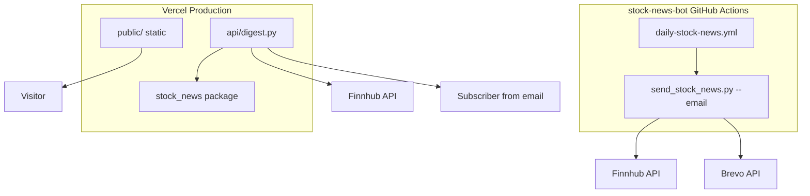
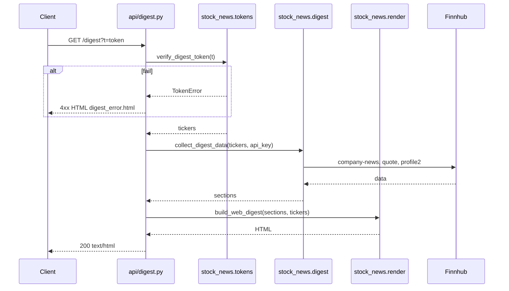

# Daily Digest — Technical Implementation

**Status:** Draft  
**Version:** 1.1  
**Last updated:** 2026-08-13  
**Related:** [Product Requirements](./product-requirements.md)

---

## 0. Repositories

| Repo | GitHub | Purpose |
|------|--------|---------|
| **daily-digest** | `https://github.com/parasdhawan17/daily-digest` | Web app (Vercel): `public/`, `api/`, `stock_news/`, templates |
| **stock-news-bot** | `https://github.com/parasdhawan17/stock-news-bot` | Email bot only (GitHub Actions + Brevo); minimal changes for signed digest URLs |

**Local paths (sibling projects):**

```
~/Documents/Projects/daily-digest/      # NEW — implement web here
~/Documents/Projects/stock-news-bot/  # EXISTING — email only; do not move web code here
```

**Vercel:** Connect the `daily-digest` repository; project display name **Daily Digest**.

---

## 1. Architecture summary

### 1.1 Current

- **Single cron:** GitHub Actions → `send_stock_news.py --email` → Finnhub → `write_web_pages()` → git push `docs/` → GitHub Pages + Brevo email.

### 1.2 Target

- **Email path (stock-news-bot):** GitHub Actions → `send_stock_news.py --email` → Finnhub → sign per-subscriber URL → Brevo.
- **Web path (daily-digest):** Vercel → `public/index.html` (static) + `api/digest.py` (serverless) → Finnhub on demand.
- **Deploy:** Vercel GitHub app on `daily-digest`, auto-deploy on push to `main`.



### 1.3 Digest request sequence



---

## 2. Repository structure

### 2.1 Target layout (`daily-digest` repo)

```
daily-digest/
├── api/
│   └── digest.py              # Vercel serverless handler
├── public/
│   ├── index.html             # Landing page
│   └── assets/                # CSS, icons
├── stock_news/                # Shared Python package
│   ├── __init__.py
│   ├── config.py
│   ├── finnhub.py
│   ├── relevance.py
│   ├── digest.py
│   ├── render.py
│   ├── formatting.py
│   └── tokens.py              # verify only on web; sign duplicated in stock-news-bot
├── templates/
│   ├── web_digest.html
│   ├── digest_error.html
│   └── (no email_digest.html — lives in stock-news-bot)
├── config/
│   └── ticker_aliases.json    # copied from stock-news-bot
├── docs/
│   ├── product-requirements.md
│   └── technical-implementation.md
├── vercel.json
├── requirements.txt
├── README.md
└── .env.example
```

### 2.2 `stock-news-bot` changes (minimal, separate repo)

```
stock-news-bot/
├── scripts/send_stock_news.py   # Add digest URL signing; remove write_web_pages from cron
├── templates/email_digest.html  # digest_url + update_tickers_url
├── stock_news_tokens.py         # OR small copy of sign_digest_token (must match daily-digest)
└── .github/workflows/daily-stock-news.yml  # email only; no docs/ push
```

**Token signing:** `DIGEST_SIGNING_SECRET` must be identical in GitHub Actions (`stock-news-bot`) and Vercel (`daily-digest`). Options:

1. **Duplicate** minimal `tokens.py` sign functions in `stock-news-bot` (v1, simplest).
2. **Publish** `stock_news` as a small shared pip package later (v2).

### 2.3 Module extraction map

Source logic copied/adapted from `stock-news-bot/scripts/send_stock_news.py` (~1500 lines) into `daily-digest/stock_news/`.

| Functions / logic | Target module |
|-----------------|---------------|
| `fetch_news`, `fetch_quote`, `fetch_company_logo`, image sanitization | `stock_news/finnhub.py` |
| Aliases, `relevance_score`, `select_stories`, `select_web_stories` | `stock_news/relevance.py` |
| `collect_digest_data`, `prepare_email_layout`, `filter_sections` | `stock_news/digest.py` |
| `build_web_digest`, `build_email_digest`, `get_jinja_env` | `stock_news/render.py` |
| Date formatters, excerpts, WhatsApp builders, `footer_text` | `stock_news/formatting.py` |
| `parse_tickers`, env vars, constants, paths | `stock_news/config.py` |
| HMAC sign/verify, `build_digest_url` | `stock_news/tokens.py` |

### 2.4 Files removed from `stock-news-bot` active path

| Artifact | Action |
|----------|--------|
| `write_web_pages()`, archive helpers | Remove from default CLI; optional `--web` for local dev |
| CI git push of `docs/` | Delete workflow step |
| `docs/index.html` updates | Stop |
| `templates/archive_index.html` | Deprecate |

---

## 3. Vercel configuration

### 3.1 Git integration

1. Import repo **`parasdhawan17/daily-digest`** at [vercel.com/new](https://vercel.com/new).
2. Set Vercel **project name:** Daily Digest.
2. Install Vercel for GitHub.
3. Production branch: `main`.
4. No GitHub Actions deploy workflow required.

**Critical:** Email cron must not commit files—otherwise every email run redeploys Vercel.

### 3.2 Project settings

| Setting | Value |
|---------|-------|
| Framework Preset | Other |
| Root Directory | `.` |
| Build Command | *(empty)* or `echo skip` |
| Output Directory | `public` |
| Install Command | `pip install -r requirements.txt` |

### 3.3 `vercel.json`

```json
{
  "rewrites": [
    { "source": "/digest", "destination": "/api/digest" }
  ],
  "headers": [
    {
      "source": "/api/digest",
      "headers": [
        { "key": "Cache-Control", "value": "private, no-store" }
      ]
    }
  ]
}
```

### 3.4 Python serverless handler

File: `api/digest.py`

```python
from http.server import BaseHTTPRequestHandler
from urllib.parse import urlparse, parse_qs

class handler(BaseHTTPRequestHandler):
    def do_GET(self):
        query = parse_qs(urlparse(self.path).query)
        token = (query.get("t") or [None])[0]
        # verify → collect_digest_data → build_web_digest → respond
```

- Route: `/api/digest` internally; public URL `/digest` via rewrite.
- Dependencies: `requests`, `jinja2` in `requirements.txt` at root.

### 3.5 Local development

```bash
pip install -r requirements.txt
npm i -g vercel   # or npx vercel
vercel dev
# Landing: http://localhost:3000/
# Digest:   http://localhost:3000/digest?t=<signed>
```

Generate test token locally:

```bash
python -c "from stock_news.tokens import build_digest_url; print(build_digest_url(['AAPL','MSFT']))"
```

---

## 4. Environment variables

### 4.1 Split by platform

| Variable | GitHub Actions | Vercel | Notes |
|----------|:-------------:|:------:|-------|
| `FINNHUB_API_KEY` | Yes | Yes | Both paths call Finnhub |
| `DIGEST_SIGNING_SECRET` | Yes | Yes | **Must match** |
| `SITE_URL` | Yes | Optional | `https://yourdomain.com` |
| `BREVO_API_KEY` | Yes | No | |
| `BREVO_LIST_ID` | Yes | No | |
| `EMAIL_FROM` | Yes | No | |
| `EMAIL_FROM_NAME` | Yes | No | |
| `BREVO_SUBSCRIBE_FORM_URL` | No | No* | Hardcode in `public/index.html` or env at build |
| `WHATSAPP_*` | Optional | No | |

\*Brevo form URL is not secret; hardcoding in static HTML is acceptable for v1.

### 4.2 Generate signing secret

```bash
openssl rand -hex 32
```

Add to GitHub Secrets (`DIGEST_SIGNING_SECRET`) and Vercel Production environment.

---

## 5. Signed URL implementation

### 5.1 Module: `stock_news/tokens.py`

**Payload (JSON before base64url):**

```json
{
  "tickers": ["AAPL", "MSFT"],
  "exp": 1735689600,
  "v": 1
}
```

**Token format:** `{payload_b64}.{signature_b64}`

**Signature:** `HMAC-SHA256(DIGEST_SIGNING_SECRET, payload_b64)`

**URL:** `{SITE_URL}/digest?t={token}`

### 5.2 Functions

| Function | Used by |
|----------|---------|
| `sign_digest_token(tickers, expires_days=14)` | Email job (`stock-news-bot` Actions) |
| `verify_digest_token(token)` | `api/digest.py` |
| `build_digest_url(tickers, site_url=SITE_URL)` | Email template context |

### 5.3 Validation rules

- Any number of valid tickers; same regex as `parse_tickers`.
- Reject expired `exp`.
- Reject bad signature.
- Do not embed email in payload (privacy).

### 5.4 Rate limiting (v1)

In `api/digest.py`:

- In-memory dict: IP → request count per 60s window.
- Max ~10 requests/IP/minute (tune as needed).
- Resets on cold start (acceptable for v1).
- v2: Vercel KV / Upstash Redis.

---

## 6. API / page behavior

### 6.1 Routes

| Path | Handler | Response |
|------|---------|----------|
| `/` | `public/index.html` | Static landing |
| `/digest` | `api/digest.py` | HTML digest or error |
| `/api/digest` | same (direct) | Same; prefer `/digest` in emails |

### 6.2 Error template: `templates/digest_error.html`

| Condition | Status | Message intent |
|-----------|--------|----------------|
| No `t` param | 400 | Use link from your email |
| Invalid signature | 403 | Link invalid |
| Expired token | 403 | Link expired; open latest email |
| Empty tickers | 400 | Invalid link |
| Finnhub / internal error | 503 | Try again later |

### 6.3 Web digest template changes

[`templates/web_digest.html`](templates/web_digest.html):

- Remove archive browser section.
- `is_archive` = false.
- `archives` = empty list.
- `fetched_at_label` = request time from handler.
- Optional CTA: “Subscribe” → `/`.

---

## 7. Email pipeline changes

### 7.1 Send loop

Per subscriber in `scripts/send_stock_news.py`:

```python
digest_url = build_digest_url(user_tickers, site_url=SITE_URL)
update_tickers_url = f"{SITE_URL}/#update-tickers"

html, text, subject = build_email_digest(
    user_sections,
    user_tickers,
    user_story_count,
    email_session,
    digest_url=digest_url,
    update_tickers_url=update_tickers_url,
)
```

### 7.2 Template

[`templates/email_digest.html`](templates/email_digest.html) footer:

- `{{ digest_url }}` — “See the full digest online”
- `{{ update_tickers_url }}` — “Update your tickers”

### 7.3 Data fetch optimization

Remove `resolve_web_tickers()` / full Brevo catalog fetch for web publish.

Email job flow:

1. Fetch Brevo subscribers.
2. `union_tickers(subscribers)` → single `collect_digest_data(union)`.
3. `filter_sections` per subscriber for email body.
4. Sign digest URL per subscriber tickers (not union).

Reduces Finnhub calls vs fetching full catalog.

---

## 8. GitHub Actions

### 8.1 `daily-stock-news.yml` (target)

```yaml
name: Daily Stock News

on:
  schedule:
    - cron: '15 13 * * *'
    - cron: '15 20 * * *'
  workflow_dispatch:

jobs:
  send-news:
    runs-on: ubuntu-latest
    steps:
      - uses: actions/checkout@v4
      - uses: actions/setup-python@v5
        with:
          python-version: '3.12'
      - run: pip install -r requirements.txt
      - name: Send email digests
        env:
          TZ: America/New_York
          FINNHUB_API_KEY: ${{ secrets.FINNHUB_API_KEY }}
          BREVO_API_KEY: ${{ secrets.BREVO_API_KEY }}
          BREVO_LIST_ID: ${{ secrets.BREVO_LIST_ID }}
          EMAIL_FROM: ${{ secrets.EMAIL_FROM }}
          EMAIL_FROM_NAME: ${{ secrets.EMAIL_FROM_NAME }}
          DIGEST_SIGNING_SECRET: ${{ secrets.DIGEST_SIGNING_SECRET }}
          SITE_URL: https://yourdomain.com
        run: python scripts/send_stock_news.py --email
```

**Removed:** `contents: write` permission (if only used for docs push), entire “Publish web digest” step.

### 8.2 CLI flags (target)

| Flag | Behavior |
|------|----------|
| `--email` | Send Brevo emails (production cron) |
| `--dry-run` | Print subjects and digest URLs; no send |
| `--recipient EMAIL` | Single subscriber filter |
| `--web` | Local only: write static HTML to `docs/` for dev |
| `--whatsapp` / `--all` | Unchanged optional channels |

Default run with no flags: **no web publish** (or print help—define explicitly in implementation).

---

## 9. Custom domain

1. Vercel → Project → Settings → Domains.
2. Add apex and `www`.
3. Configure DNS at registrar (Vercel nameservers or A/CNAME).
4. Set `SITE_URL=https://yourdomain.com` in GitHub Secrets.
5. Choose canonical host (apex vs www); redirect the other in Vercel.

---

## 10. Finnhub quota model

| Event | API calls |
|-------|-----------|
| Email job | `3 × |union_tickers|` per run |
| One digest page load | `3 × |subscriber_tickers|` (max 30) |

Example: 20 subscribers, avg 5 tickers, union 15 tickers:

- Email: 2 runs × 45 = 90 calls/day
- 40 digest opens/day: 40 × 15 = 600 calls/day
- Total ~690/day (within free tier if sparse)

Monitor: Finnhub dashboard + log digest errors in Vercel.

---

## 11. Implementation phases

### Phase 0 — Create `daily-digest` repo

- Create GitHub repo `daily-digest` (public).
- Scaffold layout, README, docs, `vercel.json`, stubs.
- Do **not** modify `stock-news-bot` except when integrating email links (Phase 3).

### Phase 1 — Package in `daily-digest`

- Create `stock_news/` and move logic from monolith.
- Implement `tokens.py`.
- Refactor CLI; `--email --dry-run` works.

**Verify:** token round-trip; dry-run prints `/digest?t=...` URLs.

### Phase 2 — Vercel skeleton

- Add `vercel.json`, `public/index.html`, `api/digest.py`, `digest_error.html`.
- `vercel dev` serves landing + digest.

**Verify:** curl signed digest returns HTML.

### Phase 3 — Email integration (`stock-news-bot`)

- Add signing module + email template + workflow changes in `stock-news-bot`.
- `SITE_URL` → Daily Digest production domain.

**Verify:** workflow_dispatch → email → click link opens `daily-digest` deployment.

### Phase 4 — Production

- Connect `daily-digest` to Vercel; env vars; custom domain.
- Tag `pre-daily-digest-migration` on both repos before go-live.

**Verify:** acceptance checklist in PRD.

### Phase 5 — Hardening

- Rate limiting, error templates, README on `daily-digest`.
- Stop `docs/` CI updates on `stock-news-bot`.

---

## 12. Testing checklist

| Test | How |
|------|-----|
| Token sign/verify | `python -c "..."` or pytest |
| Dry-run email | `python scripts/send_stock_news.py --email --dry-run --recipient you@example.com` |
| Local digest | `vercel dev` + browser |
| Bad token | `/digest?t=invalid` → 403 HTML |
| Expired token | craft token with past `exp` |
| Landing hash | `/#update-tickers` opens modal |
| PR preview | push branch → Vercel preview URL |
| No git noise | run workflow → no new commits |
| Cold start | note latency after idle |

---

## 13. Rollback procedure

1. Git revert workflow to restore `docs/` push + GitHub Pages links in email.
2. Point `SITE_URL` back to `github.io` if needed.
3. Vercel landing can stay up independently.

Keep tag `pre-vercel-migration` on last pre-change commit.

---

## 14. Vercel Hobby limits (reference)

| Resource | Typical free limit |
|----------|-------------------|
| Bandwidth | 100 GB/month |
| Serverless executions | 100k/month |
| Build minutes | 6000/month |
| Custom domains | Unlimited |

---

## 15. Dependencies

[`requirements.txt`](requirements.txt) (shared):

```
requests>=2.31.0
jinja2>=3.1.0
```

No new runtime deps for v1. Optional later: `pytest` for token tests.

---

## 17. Multi-market extension (US + India)

**Added:** 2026-08-22

### Ticker format

| Prefix | Market | Provider | Example |
|--------|--------|----------|---------|
| `US:` | US equities | Finnhub | `US:AAPL` |
| `IN:` | NSE equities | IndianAPI.in | `IN:RELIANCE` |

Bare symbols (e.g. `AAPL`) normalize to `US:AAPL` for backward compatibility. Brevo stores prefixed tickers in the `US_TICKERS` attribute.

### Data routing

```
subscribe / search / validate / digest
        ↓
  stock_news/market_data.py
        ├── US: → stock_news/finnhub.py
        └── IN: → stock_news/indianapi.py
```

`collect_digest_data(tickers, *, finnhub_key, indianapi_key)` routes per ticker prefix.

### Environment variables

| Variable | Required | Purpose |
|----------|----------|---------|
| `FINNHUB_API_KEY` | US tickers | Finnhub quotes + news |
| `INDIANAPI_API_KEY` | IN tickers | IndianAPI.in quotes + news |
| `INDIANAPI_BASE_URL` | No | Default `https://stock.indianapi.in` |

### Dual cron schedule

Railway cron (`railway.toml`): `0,45 3,10,13,15,20 * * 1-5`

| UTC | Market | Session (local) |
|-----|--------|-----------------|
| 03:45 | IN | 9:15 AM IST pre-open |
| 10:15 | IN | 3:45 PM IST post-close |
| 13:00 | US | 9:15 AM ET pre-open |
| 20:00 | US | 4:15 PM ET post-close |

`scripts/send_digests.py --cron auto` matches the current UTC minute to the correct market session. Each send includes **all** subscriber tickers (US + IN). Trading-day skips use `market_calendar.py` (US) and `in_market_calendar.py` (NSE holidays).

### India calendar

- `config/in_market_holidays.json` — seeded NSE holidays
- `scripts/refresh_in_market_holidays.py` — refresh from NSE public API
- `config/in_entities_cache.json` — offline fallback for ticker search

### API quota model (India)

| Event | API calls |
|-------|-----------|
| Email job (IN tickers) | `1 × |IN tickers|` per run (combined quote + news endpoint) |
| Digest page load (IN) | `1 × |IN tickers|` |

Monitor IndianAPI dashboard alongside Finnhub.

---

## 16. Document history

| Version | Date | Changes |
|---------|------|---------|
| 1.0 | 2026-08-13 | Initial technical spec for Vercel migration |
| 1.1 | 2026-08-13 | Renamed to Daily Digest; split `daily-digest` vs `stock-news-bot` repos |
| 1.2 | 2026-08-22 | Multi-market extension: US + India, IndianAPI.in, dual cron, ticker prefixes |
